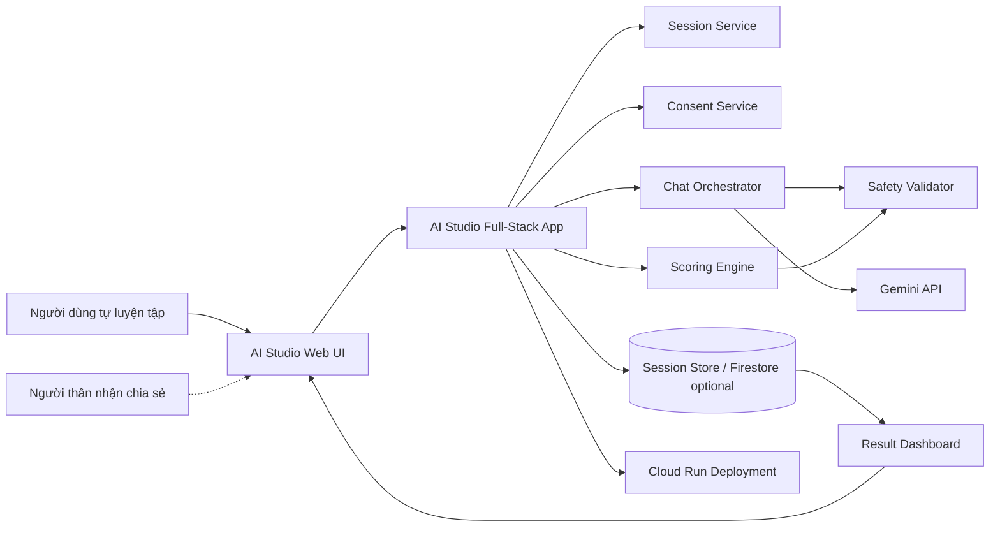
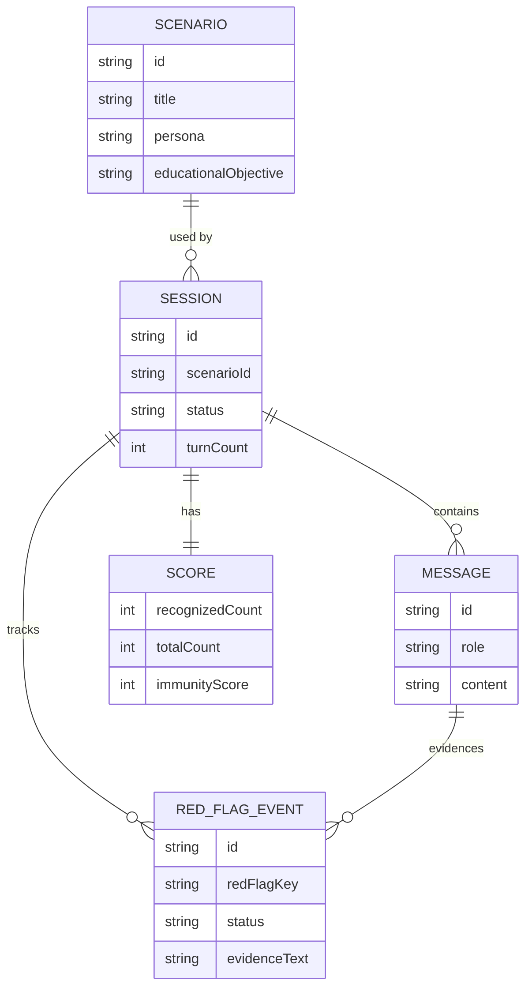
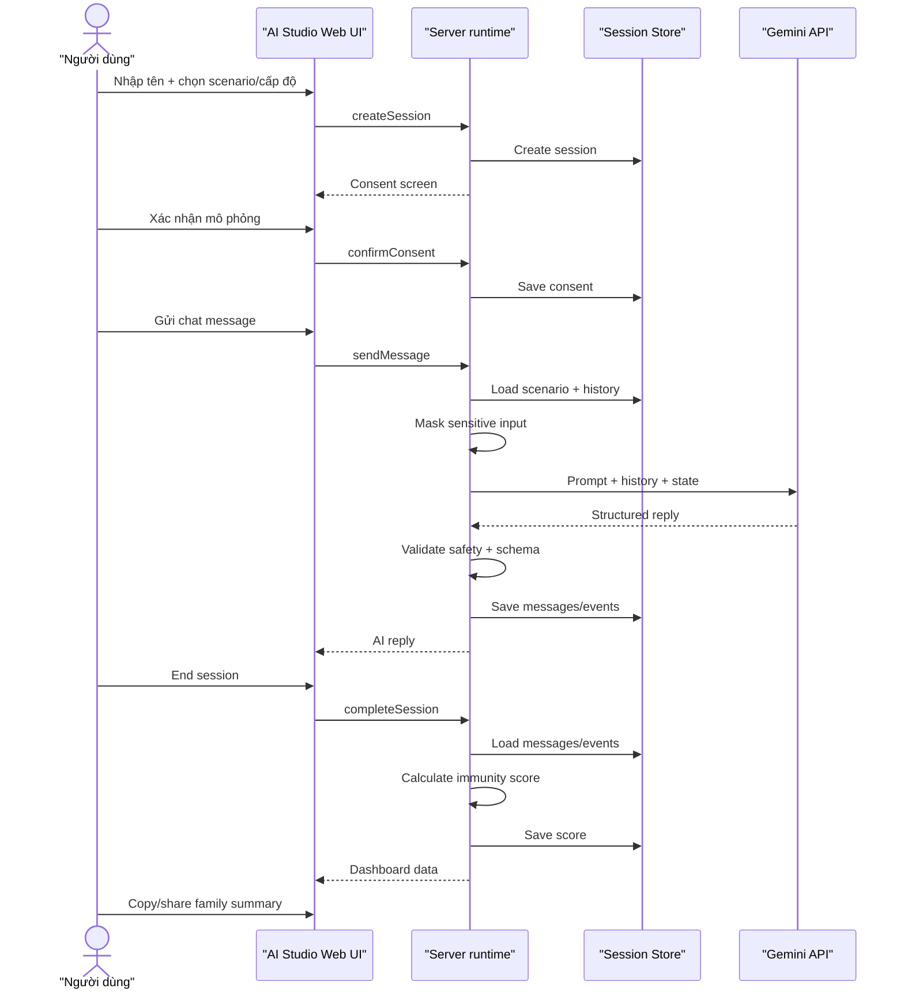
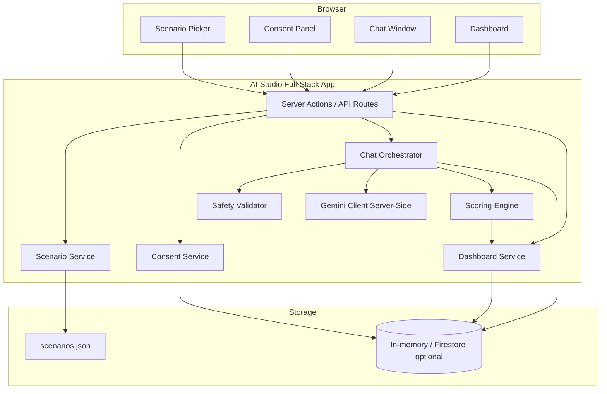

# AI Scam Inoculation - Phase 3 Technical Design

## 1. Technical Design Objective

Phase 3 chuyển PRD thành thiết kế kỹ thuật đủ rõ để team triển khai MVP theo sprint, nhưng **chưa viết code**.

Ngữ cảnh đã cập nhật: dự án tham gia **AI Riser Vietnam 2026**, track **phòng chống lừa đảo / anti-fraud**, theo tinh thần **#Vibecoding** và **#BuildwithGoogleAI**. Vì vậy hướng kỹ thuật chính là **Google AI Studio Build Mode + Gemini API + Google Cloud Run**.

Non-negotiables:

- Gemini/Google AI là lõi hội thoại động.
- Không dùng decision tree cố định cho chat simulation.
- Single-user consent, safety và scoring minh bạch là bắt buộc.
- Demo/submission ưu tiên chạy trong hệ sinh thái Google AI.
- Không dùng Spring Boot cho MVP.

## 2. Architecture

### 2.1. Recommended MVP Stack

| Layer | Tool | Rationale |
|---|---|---|
| Build environment | Google AI Studio Build Mode | Bám AI Riser 2026, hỗ trợ vibe coding, preview và publish nhanh |
| Frontend | Static web UI now; React only if ported by AI Studio | Repo hiện tại dùng vanilla JS để giảm rủi ro demo; AI Studio có thể port sang React nhưng giữ cùng flow |
| Server runtime | Node.js server-side runtime | Gọi Gemini API từ server, giữ API key không lộ client |
| AI | Gemini API | AI chính của sản phẩm |
| Storage | In-memory/session storage + JSON seed | Đủ demo nhanh; tránh DB setup phức tạp |
| Optional persistence | Firebase Firestore | Chỉ dùng nếu AI Studio setup thuận lợi và cần lưu session qua refresh/device |
| Validation | JSON schema / lightweight Zod-style validation | Kiểm soát Gemini output và scoring |
| Deployment | Publish from Google AI Studio to Cloud Run | Có public URL, bám chương trình |

Fallback local only: repo Node/static hiện tại dùng để demo nhanh và có đường port sang Google AI Studio Build Mode nếu cần nộp trong môi trường Google AI.

### 2.2. High-Level Architecture



### 2.3. Component Responsibilities

| Component | Responsibility |
|---|---|
| Web UI | Render 5 screens: entry/dashboard, scenario selection, consent, chat, result/share |
| Server runtime | Handle server actions/API routes, validate input, orchestrate session |
| Scenario Service | Load scenario templates and red flag definitions from JSON seed |
| Consent Service | Enforce single-user simulation consent before chat |
| Chat Orchestrator | Build Gemini request from system prompt + scenario + state + history |
| Gemini Client | Call Gemini API from server-side code only |
| Safety Validator | Mask sensitive input, reject unsafe AI output, block real links/QR/account/OTP requests |
| Scoring Engine | Compute transparent immunity score from red flag events |
| Dashboard Service | Aggregate score, missed red flags, highlights, next recommendation |
| Session Store | Hold sessions, messages, red flag events, scores for demo |

Runtime guardrail defaults:

- `MAX_CHAT_TURNS=8`.
- `MAX_MESSAGE_LENGTH=1000`.
- `MAX_JSON_BODY_BYTES=65536`.
- `GEMINI_TIMEOUT_MS=45000`.

## 3. Database

### 3.1. Storage Choice

Primary MVP storage:

- `scenarios.json` for 3 scenario templates.
- In-memory/session storage for active demo sessions.
- Browser/session id only for navigating between screens.

Optional if needed:

- Firebase Firestore for persistence across refresh/device.

Reason:

- AI Riser 2026 emphasizes build/demo with Google AI Studio.
- MVP does not need long-term user accounts.
- Avoid database setup becoming the main demo risk.
- Storage can be upgraded later without changing core product loop.

### 3.2. Data Entities

The same entities apply whether implemented as in-memory objects, JSON files, Firestore collections, or fallback SQLite tables.

#### `Scenario`

| Field | Type | Notes |
|---|---|---|
| `id` | string | Example: `fake_bank` |
| `title` | string | Display name |
| `persona` | string | AI role/persona description |
| `educationalObjective` | string | Learning goal |
| `allowedTactics` | string[] | Boundaries for simulated pressure |
| `redFlags` | RedFlag[] | Expected red flags |
| `stopConditions` | string[] | End conditions |
| `safetyConstraints` | string[] | Hard safety rules |

#### `Session`

| Field | Type | Notes |
|---|---|---|
| `id` | string | UUID |
| `scenarioId` | string | References `Scenario.id` |
| `userName` | string/null | Lightweight display name |
| `difficulty` | string | `easy`, `medium`, `hard` |
| `consentAt` | string/null | Required before chat |
| `status` | string | `created`, `active`, `completed`, `aborted` |
| `turnCount` | number | Chat turn counter |
| `messages` | Message[] | Masked conversation history |
| `redFlagEvents` | RedFlagEvent[] | Triggered/recognized/missed flags |
| `score` | Score/null | Final result |
| `createdAt` | string | ISO timestamp |

#### `Message`

| Field | Type | Notes |
|---|---|---|
| `id` | string | UUID |
| `role` | string | `participant`, `ai`, `system` |
| `content` | string | Masked content only |
| `metadata` | object | Validation notes, token usage, safety info |
| `createdAt` | string | ISO timestamp |

#### `RedFlagEvent`

| Field | Type | Notes |
|---|---|---|
| `id` | string | UUID |
| `messageId` | string/null | Related message |
| `redFlagKey` | string | Example: `authority_pressure` |
| `status` | string | `triggered`, `recognized`, `missed` |
| `evidenceText` | string | Short masked excerpt |

#### `Score`

| Field | Type | Notes |
|---|---|---|
| `recognizedCount` | number | Red flags recognized |
| `totalCount` | number | Total red flags in scenario |
| `immunityScore` | number | 0-100 |
| `summary` | object | Strengths, weaknesses, next recommendation |
| `createdAt` | string | ISO timestamp |

### 3.3. ERD



## 4. API / Server Actions

AI Studio may generate API routes or server actions depending on the project structure. Required contracts:

| Action | Input | Output |
|---|---|---|
| `getRuntimeStatus` | none | Gemini configured flag, model and runtime limits without secrets |
| `listScenarios` | none | 3 scenario summaries |
| `createSession` | `scenarioId`, `difficulty`, `userName` | session id |
| `confirmConsent` | `sessionId`, `consent=true` | session status |
| `sendMessage` | `sessionId`, `message` | AI reply + state |
| `getMessages` | `sessionId` | masked chat transcript for refresh recovery |
| `completeSession` | `sessionId` | final score |
| `getDashboard` | `sessionId` | score, highlights, recommendations |

### 4.1. Chat Response Contract

```json
{
  "messageId": "uuid",
  "reply": "Tin nhắn AI đã được kiểm duyệt an toàn",
  "sessionStatus": "active",
  "turnCount": 3,
  "detectedEvents": [
    {
      "redFlagKey": "urgency_threat",
      "status": "triggered",
      "evidence": "Ngân hàng cần xác minh ngay..."
    }
  ],
  "safety": {
    "maskedSensitiveInput": false,
    "aiOutputValidated": true,
    "retryUsed": false,
    "provider": "gemini",
    "fallbackReason": ""
  }
}
```

### 4.2. Score Response Contract

```json
{
  "sessionId": "uuid",
  "scenarioId": "fake_bank",
  "immunityScore": 67,
  "recognizedCount": 4,
  "totalCount": 6,
  "recognizedRedFlags": [
    {
      "key": "request_for_sensitive_info",
      "label": "Yêu cầu OTP",
      "techniqueLabel": "authority + fear - dùng danh nghĩa/đe dọa để xin dữ liệu nhạy cảm",
      "explanation": "OTP không bao giờ được chia sẻ qua chat hoặc điện thoại."
    }
  ],
  "missedRedFlags": [
    {
      "key": "authority_pressure",
      "label": "Áp lực từ danh nghĩa ngân hàng",
      "techniqueLabel": "authority - giả danh quyền lực/uy tín",
      "recommendation": "Pattern: authority. Khi một người tự xưng có quyền lực và yêu cầu hành động ngay, hãy nhận diện đây là áp lực thẩm quyền trước khi tin vào danh xưng."
    }
  ],
  "nextRecommendation": "Luyện tiếp kịch bản giả công an/cơ quan chức năng."
}
```

## 5. Folder Structure

Expected AI Studio web app structure may vary, but keep this logical organization:

```text
ai-scam-inoculation/
  server.js
  src/
    public/
      index.html
      app.js
      app.css
    services/
      scenarioService.js
      sessionService.js
      chatOrchestrator.js
      geminiClient.server.js
      safetyValidator.js
      scoringEngine.js
      dashboardService.js
    data/
      scenarios.json
  tests/
    run-tests.js
    http-smoke.ps1
    live-gemini-probe.ps1
  docs/
    demo_script.md
    ai_riser_checklist.md
  README.md
```

If AI Studio generates a different structure, preserve the same module boundaries: UI components, services, scenario data, schema validation, server-side Gemini calls.

## 6. Sequence Diagram



## 7. Component Diagram



## 8. Gemini Integration Design

### 8.1. Runtime Prompt Inputs

Gemini request must include:

- System prompt: educational, controlled simulation, consent-based, no real fraud.
- Scenario metadata: persona, allowed tactics, red flags, safety constraints.
- Conversation history: masked messages only.
- Session state: turn count, triggered red flags, stop conditions.
- Output schema instruction: JSON object with reply, red flag signals, state update.

### 8.2. Non-Decision-Tree Rule

Scenario template defines **goals and boundaries**, not exact branches. The app may enforce safety, stop conditions and scoring rules, but must not hard-code scammer replies through `if user says X then reply Y` patterns.

Allowed deterministic logic:

- Consent required before chat.
- Maximum turn count.
- Sensitive data masking.
- Safety rejection/retry.
- Score calculation.
- Dashboard aggregation.

Not allowed as main chat behavior:

- Static script with fixed branches.
- Quiz-only flow.
- Keyword-only chatbot.

### 8.3. Safety Constraints

Gemini output must be rejected or regenerated if it:

- Requests real OTP, password, CCCD, card number or bank account.
- Generates real-looking payment links, QR codes, malware/app install instructions.
- Provides operational advice for committing fraud.
- Escalates emotional pressure beyond educational simulation.
- Ignores user request to stop.

## 9. Scoring Design

### 9.1. Score Formula

```text
Immunity Score = round((recognizedRedFlags / totalRedFlags) * 100)
```

### 9.2. Red Flag Detection

MVP uses hybrid scoring:

- Scenario defines expected red flags.
- Chat orchestrator records when a red flag tactic was presented.
- Lightweight evaluator checks whether participant response shows recognition or safe behavior.
- Gemini may suggest red flag labels in JSON, but scoring engine validates against scenario schema.

### 9.3. Recognition Examples

| Participant Behavior | Scoring Interpretation |
|---|---|
| “Tôi sẽ gọi hotline ngân hàng chính thức để kiểm tra” | Recognized authority/channel risk |
| “Tôi không cung cấp OTP” | Recognized sensitive information risk |
| “Tôi sẽ hỏi lại con qua số điện thoại cũ” | Recognized identity mismatch |
| User sends fake OTP or agrees to transfer | Missed sensitive info or money transfer risk |

## 10. Deployment

### 10.1. Primary Demo Deployment

Use **Google AI Studio Publish** to deploy the full-stack web app to **Cloud Run**.

Key deployment rules:

- `GEMINI_API_KEY` must be server-side secret only.
- No API key in client code.
- Keep app private until ready to share.
- Use Cloud Run URL or AI Studio share URL for demo.
- Prepare one stable demo session but allow judges to type alternative responses.

### 10.2. Google AI Studio Notes

AI Studio Build Mode can create full-stack web apps. Official docs state the default web app includes client-side React and server-side Node.js runtime. It also supports secrets management and deployment to Cloud Run. This is why Phase 3 now prioritizes AI Studio over a separate FastAPI stack.

### 10.3. Demo Reliability Plan

- Seed 3 scenarios locally in `scenarios.json`.
- Keep scenario intro local; first screen should not need AI.
- Limit chat to 6-8 turns.
- Retry Gemini once if JSON/schema fails.
- Fallback to a safe educational message if Gemini is unavailable.
- Include visible typing/loading state.
- Prepare manual checklist for AI-native response test.

## 11. Sprint Planning

Phase 6 implementation will be split by sprint, but Phase 3 provides the plan now.

### Sprint 1 - AI Studio App Foundation

Deliverables:

- AI Studio full-stack web app created.
- Scenario seed file with 3 MVP scenarios.
- Session state model.
- Consent enforcement.
- Basic server-side Gemini secret setup.

Exit Criteria:

- Can create session.
- Cannot start chat without simulation consent.
- Gemini key is not exposed client-side.

### Sprint 2 - UI Flow

Deliverables:

- Scenario picker.
- Single-user simulation consent.
- Chat window shell.
- Dashboard shell.
- Readable styling for 55+ users.

Exit Criteria:

- Full page flow works with mock AI reply.
- UI copy is clear, ethical and non-judgmental.

### Sprint 3 - Gemini Dynamic Chat

Deliverables:

- Server-side Gemini client.
- Chat orchestrator.
- Prompt input assembly.
- Structured JSON output validation.
- Safety validator.
- Dynamic response test with 3 different user inputs.

Exit Criteria:

- Gemini replies dynamically from history/state.
- No decision-tree main chat flow.
- Unsafe outputs are blocked or retried.

### Sprint 4 - Scoring and Dashboard

Deliverables:

- Red flag event tracking.
- Immunity score calculation.
- Dashboard with highlights.
- Next scenario recommendation.
- Score response contract.

Exit Criteria:

- Completed session produces score.
- Dashboard shows recognized/missed red flags and actionable next step.

### Sprint 5 - Cloud Run Demo Hardening

Deliverables:

- Publish from AI Studio to Cloud Run.
- Demo script.
- AI Riser judging checklist.
- Prompt evaluation cases.
- Fallback path.

Exit Criteria:

- 3-minute demo path is stable.
- Cloud Run/shared URL works.
- AI-native checklist passes.
- Safety checklist passes.

## 12. Technical Risks

| Risk | Severity | Mitigation |
|---|---|---|
| AI Studio generated structure differs from this design | Medium | Preserve logical module boundaries even if folders differ |
| Gemini latency breaks demo rhythm | High | Limit turns, show typing state, retry once, prepare fallback |
| Gemini returns invalid JSON | High | JSON schema validation, retry with repair prompt, fallback safe message |
| API key exposure | High | Server-side Gemini calls only, use AI Studio secrets |
| Session state lost on server restart | Medium | Same-instance route/transcript recovery exists; keep demo linear and add Firestore only if persistence is required |
| Scoring feels arbitrary | Medium | Use explicit red flag schema and visible formula |
| UI too plain for judges | Medium | Prioritize clean chat, readable dashboard, clear highlight states |

## 13. Phase 3 Deliverables

- `TechnicalDesign.md`: completed.
- Architecture: completed.
- Database/storage design: completed.
- API/server action design: completed.
- Folder structure: completed.
- Sequence diagram: completed.
- ERD: completed.
- Component diagram: completed.
- Deployment plan: completed.
- Sprint planning: completed.

## 14. Phase 3 Review Gate

Phase 3 recommends moving to **Phase 4 - AI Design** next, not implementation yet.

Open decisions before Phase 4:

1. Confirm Gemini model name available in Google AI Studio/Gemini API.
2. Define exact JSON schema for Gemini chat output.
3. Define prompt guardrails for fake bank scenario first.
4. Define retry/fallback behavior in detail.
5. Confirm whether session state remains in-memory for MVP or Firestore becomes required for deployed persistence.

**Status:** Phase 3 ready for review. Chỉ chuyển sang Phase 4 sau khi review xong.
