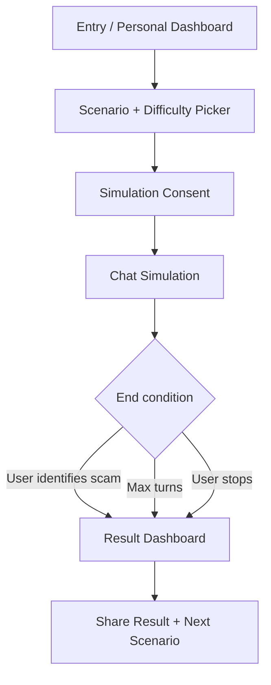

# AI Scam Inoculation - Phase 5 UI

## 1. UI Objective

Phase 5 thiết kế trải nghiệm MVP cho **AI Scam Inoculation** theo hướng demo trên **Google AI Studio / Cloud Run**.

UI phải phục vụ 3 mục tiêu:

- Người dùng dễ đọc, dễ thao tác, không cảm thấy bị kiểm tra.
- Giám khảo thấy ngay AI-native value: chat phản hồi động, không phải quiz.
- Người dùng hiểu kết quả: điểm miễn dịch, red flags nhận diện/bỏ lỡ, gợi ý luyện tiếp, và có thể chia sẻ tóm tắt cho người thân.

## 2. UX Principles

| Principle | Decision |
|---|---|
| Clarity first | Mỗi màn hình chỉ có một hành động chính |
| Consent is explicit | Không bắt đầu chat nếu chưa xác nhận mô phỏng |
| Familiar chat | Chat layout giống messenger phổ biến, nhưng không dùng brand Zalo/Facebook |
| Non-judgmental feedback | Không dùng từ “sai”, “kém”, “bị lừa”; dùng “cần luyện thêm” |
| Fast demo | Happy path hoàn tất trong 3 phút |
| 55+ readable | Font lớn, contrast cao, button rõ, ít icon lạ |

## 3. Screen Flow



## 4. Wireframes

### 4.1. Screen 1 - Entry / Personal Dashboard

Purpose: Người dùng bắt đầu nhanh và xem lịch sử luyện tập trong phiên hiện tại.

```text
┌────────────────────────────────────────────┐
│ AI Scam Inoculation                         │
│ Luyện miễn dịch lừa đảo                     │
├────────────────────────────────────────────┤
│ Tên của bạn                                 │
│ [ Cô Lan                                    ]│
│                                            │
│ Lịch sử luyện tập                           │
│ Chưa có buổi luyện nào                      │
│                                            │
│ [Bắt đầu luyện tập]                         │
└────────────────────────────────────────────┘
```

### 4.2. Screen 2 - Scenario Picker

Purpose: Người dùng chọn tình huống và cấp độ.

```text
┌────────────────────────────────────────────┐
│ AI Scam Inoculation                         │
│ Luyện nhận diện lừa đảo cho gia đình        │
├────────────────────────────────────────────┤
│ Chọn tình huống luyện tập                   │
│                                            │
│ ┌────────────────────────────────────────┐ │
│ │ Giả ngân hàng xác minh tài khoản       │ │
│ │ Luyện nhận diện yêu cầu mã xác minh    │ │
│ │ [Chọn]                                 │ │
│ └────────────────────────────────────────┘ │
│                                            │
│ ┌────────────────────────────────────────┐ │
│ │ Giả người thân cần tiền gấp            │ │
│ │ Luyện xác minh danh tính người nhắn    │ │
│ │ [Chọn]                                 │ │
│ └────────────────────────────────────────┘ │
│                                            │
│ ┌────────────────────────────────────────┐ │
│ │ Giả công an/cơ quan chức năng          │ │
│ │ Luyện xử lý áp lực đe dọa              │ │
│ │ [Chọn]                                 │ │
│ └────────────────────────────────────────┘ │
└────────────────────────────────────────────┘
```

Primary CTA: `Chọn tình huống`

### 4.3. Screen 3 - Simulation Consent

Purpose: Người dùng xác nhận đây là luyện tập mô phỏng.

```text
┌────────────────────────────────────────────┐
│ Trước khi bắt đầu                           │
├────────────────────────────────────────────┤
│ Đây là mô phỏng giáo dục.                   │
│ Đây không phải tình huống thật.             │
│                                            │
│ □ Tôi hiểu không được nhập dữ liệu cá nhân  │
│   thật như OTP, CCCD, số tài khoản          │
│                                            │
│ [Bắt đầu mô phỏng]                          │
└────────────────────────────────────────────┘
```

### 4.4. Screen 4 - Chat Simulation

Purpose: Người tham gia chat với Gemini simulation.

```text
┌────────────────────────────────────────────┐
│ Giả ngân hàng                     [Dừng]   │
├────────────────────────────────────────────┤
│                                            │
│        ┌──────────────────────────────┐    │
│        │ Chào cô/chú, tài khoản đang  │    │
│        │ cần xác minh trong hôm nay.  │    │
│        └──────────────────────────────┘    │
│                                            │
│ ┌──────────────────────────────┐           │
│ │ Tôi cần kiểm tra lại đã.     │           │
│ └──────────────────────────────┘           │
│                                            │
│        ┌──────────────────────────────┐    │
│        │ Dạ nếu chậm tài khoản có thể │    │
│        │ bị tạm khóa trong mô phỏng.  │    │
│        └──────────────────────────────┘    │
│                                            │
├────────────────────────────────────────────┤
│ Nhập tin nhắn...                    [Gửi]  │
└────────────────────────────────────────────┘
```

Behavior:

- AI bubble on right/neutral color.
- Participant bubble on left/primary color.
- Visible loading state: “Đang phản hồi...”
- Stop button always visible.
- If sensitive input detected, show inline safety notice.

### 4.5. Screen 5 - Result Dashboard + Share

Purpose: Người dùng xem kết quả actionable và chia sẻ tóm tắt nếu muốn.

```text
┌────────────────────────────────────────────┐
│ Kết quả buổi luyện tập                      │
├────────────────────────────────────────────┤
│ Điểm miễn dịch                              │
│ ┌────────────────────────────────────────┐ │
│ │ 75 / 100                               │ │
│ │ Nhận diện 3 / 4 dấu hiệu cảnh báo      │ │
│ └────────────────────────────────────────┘ │
│                                            │
│ Đã nhận diện tốt                           │
│ ✓ Không cung cấp mã xác minh               │
│ ✓ Muốn gọi hotline chính thức              │
│                                            │
│ Cần luyện thêm                             │
│ ! Áp lực khẩn cấp / dọa khóa tài khoản     │
│                                            │
│ Đoạn hội thoại cần chú ý                    │
│ ┌────────────────────────────────────────┐ │
│ │ “Nếu chậm tài khoản có thể bị tạm khóa” │ │
│ │ Dấu hiệu: tạo áp lực thời gian          │ │
│ └────────────────────────────────────────┘ │
│                                            │
│ [Copy tóm tắt cho người thân]              │
│ [Luyện tiếp: Giả công an]                  │
└────────────────────────────────────────────┘
```

## 5. Design System

### 5.1. Color Tokens

| Token | Hex | Use |
|---|---|---|
| `--color-bg` | `#F7F8FA` | App background |
| `--color-surface` | `#FFFFFF` | Main panels/cards |
| `--color-text` | `#1F2937` | Primary text |
| `--color-muted` | `#6B7280` | Secondary text |
| `--color-primary` | `#2563EB` | Primary buttons and participant messages |
| `--color-primary-soft` | `#DBEAFE` | Soft highlights |
| `--color-success` | `#15803D` | Recognized red flag |
| `--color-warning` | `#B45309` | Missed red flag |
| `--color-danger` | `#B91C1C` | Safety warning |
| `--color-border` | `#D1D5DB` | Borders |

Avoid:

- Overusing red as the main theme.
- Dark low-contrast UI.
- Decorative gradients/orbs.
- Tiny gray text.

### 5.2. Typography

| Token | Size | Use |
|---|---|---|
| `--font-base` | 18px | Default body text for 55+ readability |
| `--font-small` | 15px | Secondary labels |
| `--font-title` | 26px | Screen titles |
| `--font-section` | 21px | Dashboard sections |
| `--line-height` | 1.5 | Comfortable reading |

Rules:

- Do not scale font by viewport width.
- Use sentence case in Vietnamese.
- Avoid dense paragraphs.

### 5.3. Spacing

| Token | Value |
|---|---|
| `--space-1` | 4px |
| `--space-2` | 8px |
| `--space-3` | 12px |
| `--space-4` | 16px |
| `--space-6` | 24px |
| `--space-8` | 32px |

### 5.4. Components

#### Button

- Height: 48px minimum.
- Border radius: 8px maximum.
- Text: clear verb, e.g. `Bắt đầu luyện tập`, `Gửi`, `Dừng`.
- Disabled state obvious but readable.

#### Scenario Card

- One card per scenario.
- Shows title, short description, primary CTA.
- Red flags hidden until dashboard to preserve the training effect.

#### Consent Checkbox

- Large checkbox target.
- Consent copy short and explicit.
- Primary CTA disabled until required checkbox checked.

#### Chat Bubble

- Max width: 78%.
- AI bubble: white surface with border.
- Participant bubble: primary soft or primary color depending contrast.
- No avatar needed for MVP.

#### Red Flag Highlight

- Use left border and label.
- Do not use only color; include text label like `Dấu hiệu cảnh báo`.

## 6. Screen Copy

### 6.1. Product Name

Use:

```text
AI Scam Inoculation
```

Vietnamese supporting copy:

```text
Luyện nhận diện lừa đảo cho gia đình
```

### 6.2. Consent Copy

User:

```text
Tôi hiểu đây là mô phỏng luyện tập và không phải tình huống thật.
```

### 6.3. Safety Copy

```text
Không nhập OTP, mật khẩu, CCCD, số thẻ hoặc số tài khoản thật.
```

### 6.4. Dashboard Tone

Use:

- `Đã nhận diện tốt`
- `Cần luyện thêm`
- `Gợi ý luyện tiếp`
- `Dấu hiệu cảnh báo`

Avoid:

- `Bạn sai`
- `Bạn bị lừa`
- `Điểm yếu nghiêm trọng`
- `Không đạt`

## 7. Responsive Behavior

### Mobile First

- Single-column layout.
- Sticky chat input at bottom.
- Large tap targets.
- Dashboard sections stacked vertically.

### Desktop

- Max content width: 960px.
- Chat screen can use centered phone-like column.
- Dashboard may use two columns: score summary and red flag list.

## 8. Accessibility

Requirements:

- Color contrast at least WCAG AA.
- All buttons have text labels.
- Form inputs have labels.
- Error messages are text, not color-only.
- Keyboard submit for chat input.
- Stop button reachable and visible.

## 9. Demo Script UI Path

1. Open app on scenario picker.
2. Select `Giả ngân hàng`.
3. Pick difficulty.
4. Confirm simulation consent.
5. Enter 2-3 different replies to show Gemini dynamic behavior.
6. End session.
7. Show dashboard with score and red flag highlights.
8. Copy/share result summary.

## 10. Phase 5 Risk Report

| Risk | Severity | Mitigation |
|---|---|---|
| UI looks like a quiz, not AI-native simulation | High | Chat is central screen; dashboard highlights actual conversation |
| Consent feels like legal friction | Medium | Keep copy short, human, and clear |
| 55+ users struggle with small controls | High | 18px base font, 48px buttons, simple layout |
| Dashboard overwhelms user | Medium | Show score, then 2 short lists: recognized and needs practice |
| Demo takes too long | Medium | Keep scenario creation under 60 seconds |

## 11. Phase 5 Deliverables

- Wireframe: completed.
- Screen Flow: completed.
- Design System: completed.
- Screen copy: completed.
- Responsive/accessibility requirements: completed.
- Demo UI path: completed.

## 12. Phase 5 Review Gate

Phase 5 recommends moving to **Phase 6 - Implementation** next.

Carry forward:

- Build actual usable app first screen, not landing page.
- Keep scope to 4 core screens.
- Prioritize chat dynamic behavior before polishing dashboard.
- Use Google AI Studio full-stack app if available.

**Status:** Phase 5 ready for review.
